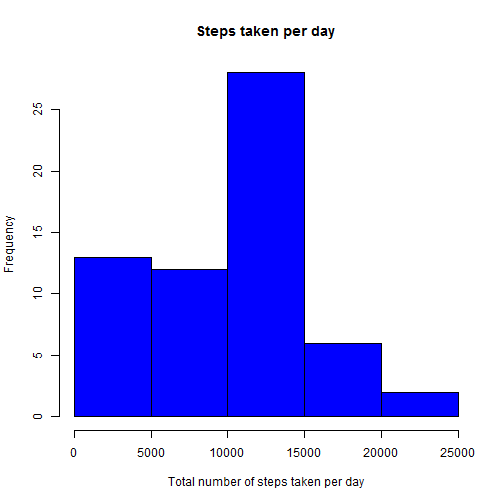
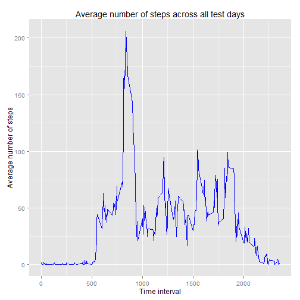
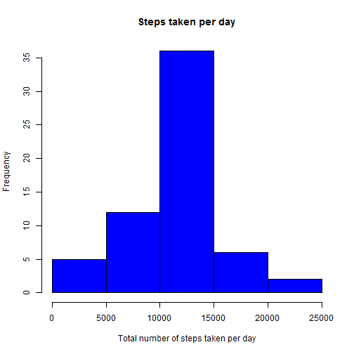

## Loading and preprocessing the data

The data set was downloaded from the Reproducible Research [course site](https://d396qusza40orc.cloudfront.net/repdata%2Fdata%2Factivity.zip). The file was read as a csv, with no other preprocessing steps done.

```{ r}
unzip("activity.zip")
```


```r
activity <- read.csv("activity.csv", stringsAsFactors = FALSE)
```

Required libraries:

```r
library(dplyr)
library(ggplot2)
library(sqldf)
library(lattice)
```

## What is mean total number of steps taken per day?

The total number of steps per day was first computed, ignoring NA values.


```r
sum_steps = activity %>% group_by(date) %>% summarise(sum(as.numeric(steps), na.rm=TRUE))
```

Below is a histogram of these results:


```r
hist(sum_steps$`sum(as.numeric(steps), na.rm = TRUE)`, col="blue", main="Steps taken per day", xlab="Total number of steps taken per day")
```

 


```r
mean = mean(sum(as.numeric(activity$steps), na.rm = TRUE))
median = median(sum(as.numeric(activity$steps), na.rm = TRUE))
```
The mean steps per day was 5.70608 &times; 10<sup>5</sup> and the median number of steps per day was 5.70608 &times; 10<sup>5</sup>.

## What is the average daily activity pattern?

The following is a time series plot of the 5-minute interval (x-axis) and the average number of steps taken, averaged across all days (y-axis)


```r
aveStepsOverInterval = activity %>% group_by(interval) %>% summarise(mean(steps, na.rm=TRUE))
g = ggplot(aveStepsOverInterval, aes(x=interval, y = `mean(steps, na.rm = TRUE)`)) + geom_line(colour='blue') + labs(x = "Time interval", y = "Average number of steps", title="Average number of steps across all test days")
print(g)
```

 

The 5-minute interval with the highest mean of steps:


```r
aveStepsOverInterval[which.max(aveStepsOverInterval$`mean(steps, na.rm = TRUE)`), 1]
```

```
## Source: local data frame [1 x 1]
## 
##   interval
## 1      835
```

## Imputing missing values

The total number of missing values of the dataset is:


```r
sum(is.na(activity$steps))
```

```
## [1] 2304
```

These NA values are then filled in using the mean of its 5-minute time interval.


```r
aveStepsOverDay = activity %>% group_by(date) %>% summarise(mean(steps, na.rm=TRUE))
for (i in 1:nrow(activity))
{
    if (is.na(activity[i, 1])) # if NA steps
    {
        toMatch = activity[i, 3]
        match = sqldf(sprintf("select * from aveStepsOverInterval where interval = '%s'", toMatch))
        activity[i, 1] = match[1, 2]
    }
}
```


```r
sumStepsImputed = activity %>% group_by(date) %>% summarise(sum(as.numeric(steps)))
hist(sumStepsImputed$`sum(as.numeric(steps)`, col="blue", main="Steps taken per day", xlab="Total number of steps taken per day")
```

 
    

```r
meanImputed  = mean(sum(as.numeric(activity$steps)))
medianImputed = median(sum(as.numeric(activity$steps)))
```
The new mean and median using imputed values are 6.5673751 &times; 10<sup>5</sup> and 6.5673751 &times; 10<sup>5</sup>, respectively.

## Are there differences in activity patterns between weekdays and weekends?

Week day names for the dates were first obtained, and these were classified as either weekdays or weekends.


```r
activity$date = strptime(activity$date, "%Y-%m-%d")
activity$dayName = weekdays(activity$date)
grepWeekends = grep("^S", activity[, 4])
activity$dayType = NA
for (i in grepWeekends)
{
    activity[i, 5] = "weekend"
}
for (i in 1:nrow(activity))
{
    if (is.na(activity[i, 5])) # if NA dayType
    {
        activity[i, 5] = "weekday"
    }
}
```
    
Mean number of steps over interval


```r
activity$dayType = as.factor(activity$dayType)
aveStepsNew = aggregate(steps ~ interval + dayType, data = activity, FUN = "mean")
```

Panel plot containing a time series plot of the 5-minute interval (x-axis) and the average number of steps taken, averaged across all weekday days or weekend days (y-axis).


```r
xyplot(steps ~ interval | dayType, aveStepsNew, layout = c(1, 2), type = "l")
```

 
